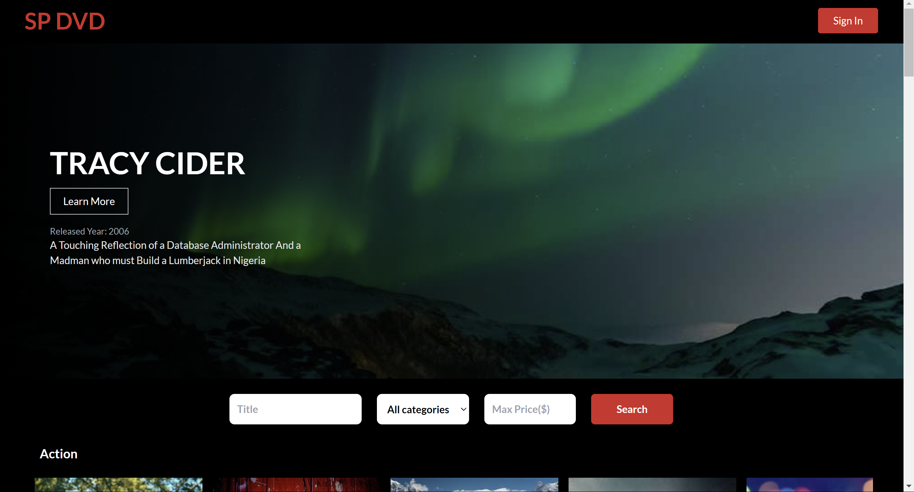
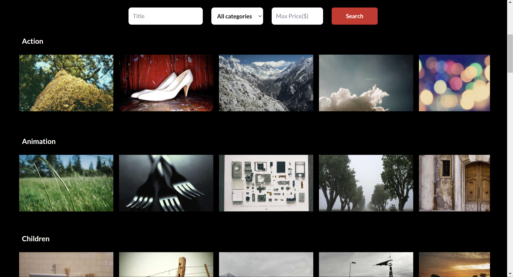

# **Netflix Clone**
==========================

Netflix Clone is a mock streaming platform built with Express.js, React, TailwindCSS, featuring authentication and input validation with Express Validator.

## How it works
---------------

Provide a movie catelog experience with authentication, content streaming, and customization options.

## Try it out
------------

Visit our site at https://netflix-clone-thtc.onrender.com/ to experience it for yourself!

## Features
----------

### Authentication

* Users can sign up, log in, and log out securely.

### Netflix-like UI

* Clean and intuitive user interface mimicking Netflix's design.

### Input Validation

* Server-side input validation to ensure data integrity and security.

## Screenshots
----------

Screenshot of the home page

Screenshot of the search bar

Screenshot of the ratings page on each movie

## Author
----------

*Lim Zhen Yang*

## Tech Stack
---------------

### Frontend

* React
* TailwindCSS

### Backend

* Express.js
* MySQL
* Express Validator

### Security

* JWT (JSON Web Tokens)
